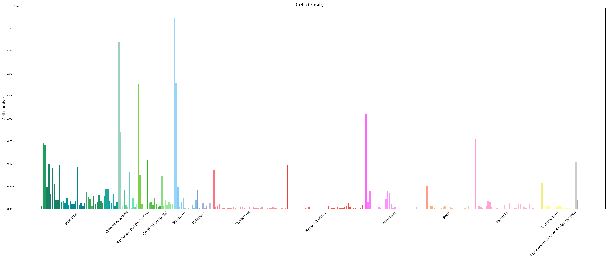
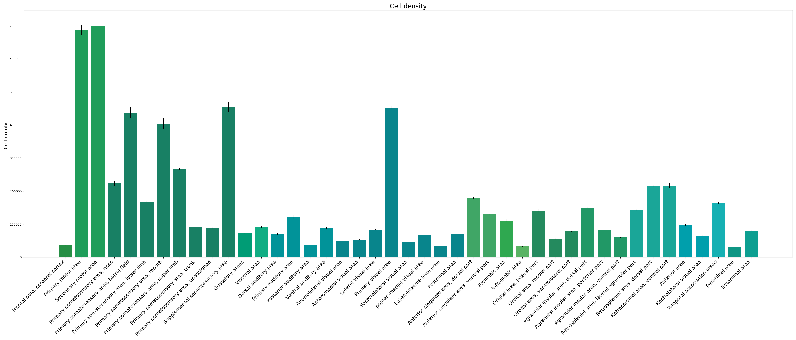
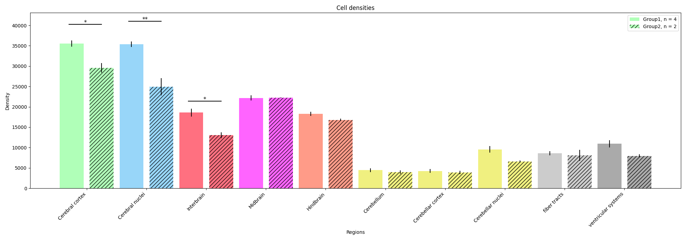
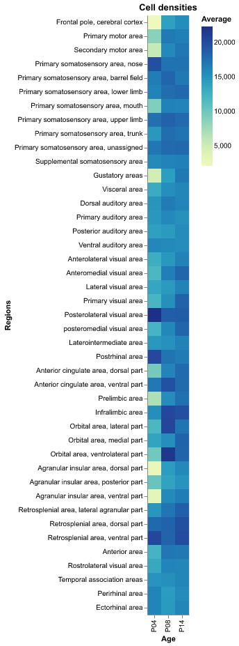

# visualization scripts
 Scripts for visualizing brain-wide expression data mapped to the Allen CCF

 This repository contains various scripts for visualizing brain-wide expression data, e.g. numbers or densities of neurons. In principle, the scripts can be used to plot any metric across the brain, so long as the data is provided in the correct format. The scripts have been tested mainly with data mapped to CCFv3-2017, but may also work for data mapped to any version of the Allen CCF. 

 The repository is under development and any feedback is very welcome. I aim for this to be a useful resource for plotting brain-wide, atlas mapped data.

## Available plot types
All the plots can be made at different levels of the atlas hierarchy, or regions within a parent region can be selectively plotted. 

### Bar graphs 
Bar graphs are useful for an intuitive interpretation of region-wise metrics in one or more groups. With the bar graph codes in this repository, you can make graphs for single or multiple samples, and for one or more groups. For graphs with two groups, t-test is available as a user option. Note that it is good practice to decide what comparisons to make *before* creating the plots.

*Example graph showing all brain regions at CustomLevel2*

*Example graph showing all regions at CustomLevel2 that fall under the "Isocortex" parent region. This graph was made with data from 4 subjects, thus also showing error bars.*

*Example graph showing all regions at CustomLevel7 for two different groups, with t-test performed.*

### Line graphs
Line graphs are particularly useful for showing change over time, e.g. for developmental studies. With the line graph script, you can add data from multiple groups and create line graphs at any level of the hierarchy or for a custom set of regions. The lines can be colored by the atlas or with random colors (sometimes, coloring by the atlas in this particular plot makes it too difficult to distinguish different lines).

*Example line graph showing all regions at CustomLevel3 that fall under the "Cortical subplate" parent region, with random color scheme.*

### Heatmaps
Heatmaps can be a good way to plot relative differences between many groups across many regions, which would typically yield very cluttered bar or line graphs.

*Example heatmap showing all regions at CustomLevel1 that fall under the "Isocortex" parent region, for three groups.*

### Brainglobe atlas heatmaps
[Brainglobe-heatmap](https://github.com/brainglobe/brainglobe-heatmap) provides an excellent package to create atlas-based heatmaps. The atlas heatmaps script in this repository can be used to create a user-defined number of heatmap planes (coronal, sagittal or horizontal) at different levels of the hierarchy.

*Example horizontal atlas plate heatmap at CustomLevel1*

## Getting started
It is advisable to set up a specific environment in which to run the scripts from this repository. You can install all required packages from the requirements.txt file provided in this repository.

## Format requirements:
It is essential that your data are formatted correctly for these scripts to work. See **files > counted_3d_cells.csv** for an example input file.
 - Data should be provided in .csv format, with each region of the brain as a row and the data to be plotted in column(s).
 - The regions of the brain need to be identified by their atlas ID in a column named "ROI_id"
 - Every region in the Allen CCF should be present as a row, including higher-order regions. Thus, even if data were collected at the finest level of the hierarchy, pooled data from all children should be present for all parents.
 - If you want to plot data from different animals and groups, each subject should be represented in a separate sheet
 - The columns for the values to be plotted can be called anything (the user will specify the column name when using the different scripts), but should be named consistently across sheets for different animals in order to use scripts that group and average data

## Future plans:
- Support for plotting data mapped to the WHS rat brain atlas
- Automatic conversion of data generated via the QUINT workflow to the format required for these scripts
   
